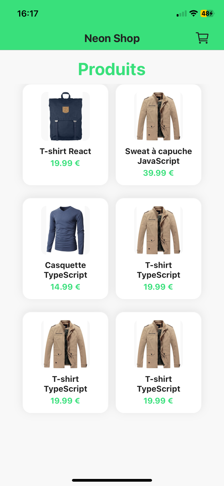
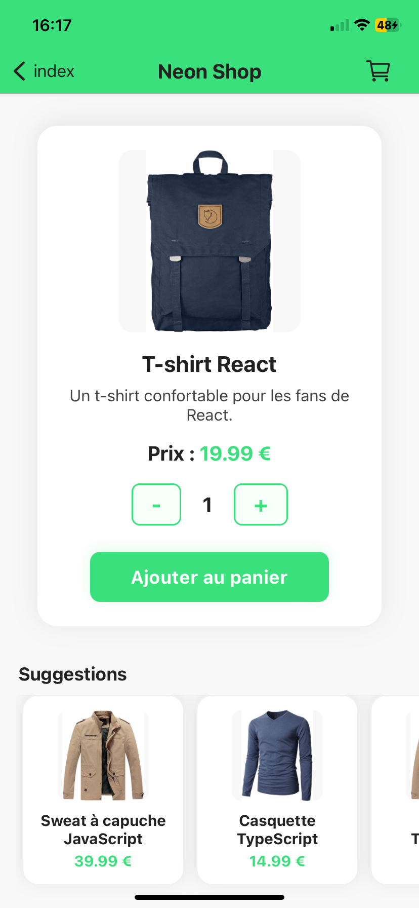
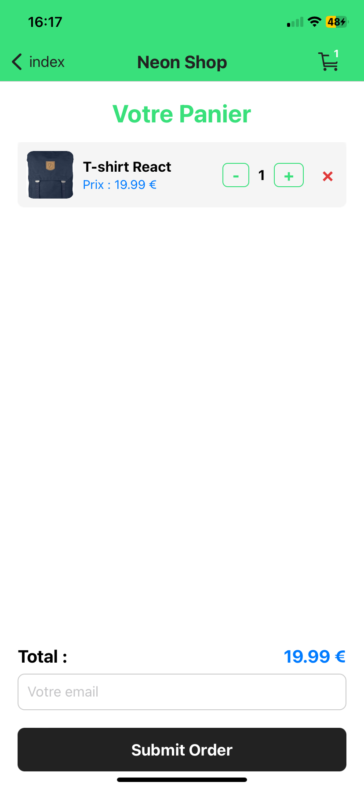

# 🛒 Neon Shop

Neon Shop est une application mobile de e-commerce développée en **React Native** avec **Expo Router**. Elle permet de parcourir une liste de produits, d’ajouter des articles à un panier, de consulter le détail de chaque produit, de gérer la quantité, et de passer commande. L’interface est moderne, fluide et inspirée des meilleures pratiques du mobile shopping.

---

## ✨ Aperçu

- **Accueil** : Grille de produits avec images, titres et prix.
- **Détail produit** : Fiche complète, choix de quantité, ajout au panier, suggestions de produits.
- **Panier** : Liste des articles, modification des quantités, suppression, total, champ email et bouton de commande.
- **Header** : Barre verte personnalisée avec icône panier et badge du nombre d’articles.
- **Persistance** : Le panier est sauvegardé même après fermeture de l’application.

---

## 🏗️ Architecture & Structure

- **React Native** (Expo) : développement mobile multiplateforme
- **Expo Router** : navigation type file-based routing
- **Context API** : gestion du panier (ajout, suppression, quantité)
- **AsyncStorage** : persistance locale du panier
- **FlatList** : affichage performant des listes
- **Composants réutilisables** : `ProductCard`, `CartIcon`, etc.

### Arborescence principale

```
ts-reactnative-shop/
│
├── app/                # Pages (accueil, détail, panier, layout)
│   ├── index.tsx       # Page d'accueil (liste produits)
│   ├── [id].tsx        # Page détail produit
│   ├── cart.tsx        # Page panier
│   └── _layout.tsx     # Layout global (header, provider)
│
├── components/         # Composants réutilisables (ProductCard, CartIcon...)
├── context/            # Context API (cartContext)
├── data/               # Fichiers de données (products.json)
├── assets/             # Images, icônes, etc.
├── hooks/              # Hooks personnalisés (si besoin)
├── package.json        # Dépendances et scripts
└── README.md           # Ce fichier
```

---

## 🚀 Fonctionnalités principales

- **Navigation fluide** entre pages (Expo Router)
- **Affichage en grille** des produits (FlatList, 2 colonnes)
- **Détail produit** avec suggestions dynamiques
- **Ajout, suppression, modification de quantité** dans le panier
- **Persistance** du panier avec AsyncStorage
- **Design moderne** et responsive

---

## 🖼️ Aperçu visuel

- 
- 
- 

---

## ⚙️ Lancer le projet

1. **Installer les dépendances**
   ```bash
   npm install
   ```
2. **Lancer l’application**
   ```bash
   npx expo start --clear
   ```
3. **Scanner le QR code** avec l’application Expo Go sur votre mobile, ou lancer sur un émulateur.

---

## 📦 Technologies principales
- React Native (Expo)
- Expo Router
- Context API
- AsyncStorage
- TypeScript
- Expo Vector Icons

---

## 🙏 Remerciements

Projet réalisé pour l’apprentissage de React Native, Expo et la gestion d’état moderne.

---

**Auteur :** [Arthur JAFFRO
